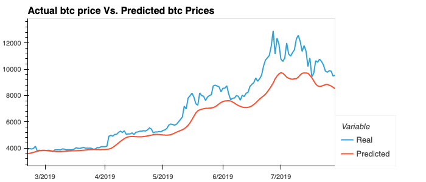
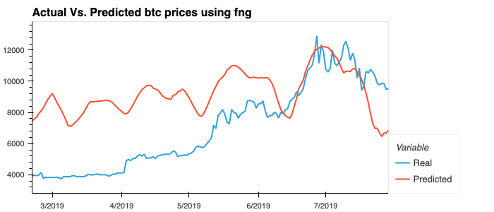

# LSTM Stock Predictor

## Table of Contents

<ol>
<li>
Data Prep for Training and Testing
<li>
Build and train custom LSTM RNNS
<li>
Evaluate Model Performance
</li>
</ol>

**Files:** [Stock Predictor](./code/lstm_stock_predictor_closing.ipynb)
**Files:** [Stock Predictor usinf fng sentiment](./code/lstm_stock_predictor_fng.ipynb)

## Data Prep for Training and Testing

- [x] Use the FNG values to predict future closing prices.
- [x] Use the past closing prices to predict future closing prices. 
- [x] Apply the MinMaxScaler to the X and Y values to scale the data for the model. 
- [x] Reshape X_train and X_test to fit the model requirements (samples, time steps, features). 

## Build and train custom LSTM RNNS

- [x] Create a notebook to fit the data using FNG Values. 
- [x] Create a notebook to fit the data using closing prices. 

## Evaluate Model Performance

- [x] Determine which model had the lowest loss.
    - Model using closing prices
- [x] Determine which model tracks the actual values best over time.
    - Model using closing prices
- [x] Determine the appropriate Window Size for the model. 

